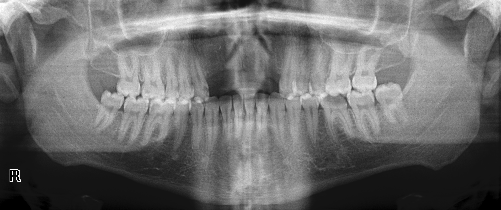
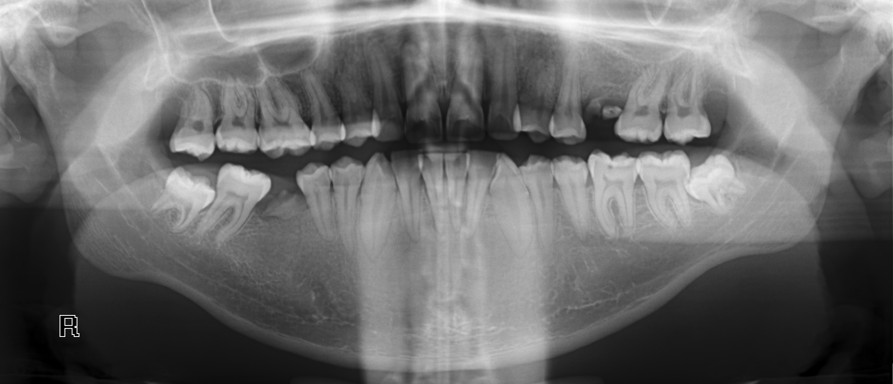

# Hanyang_Biodata
 
한양대학교 에리카 데이터엔지니어 과정 중
바이오데이터 전처리 연습에 관한 내용입니다 
 
 

### 목록은 다음과 같습니다.
1. 정형 데이터 전처리 - 당뇨병(DIABETES) 데이터 
- 이전에 포스코 Bigdata 아카데미에서 받은 데이터를 사용하였습니다
 

2. 비정형 데이터 전처리 - 치아 Image 데이터
- 치아 image 공개 데이터를 사용하였습니다
- [데이터](https://data.mendeley.com/datasets/hxt48yk462/2)
- 이미지 예시는 다음과 같습니다

 

3. 바이러스 유전체 염기서열 전처리 - Influenza / Covid fasta 데이터
- [Influenza A virus (A/Perth/260/2009(H1N1)) segment 4 hemagglutinin (HA) gene](https://www.ncbi.nlm.nih.gov/nuccore/HM624086.1)
- [Severe acute respiratory syndrome coronavirus 2 isolate Wuhan-Hu-1](https://www.ncbi.nlm.nih.gov/nuccore/NC_045512.2)

 
